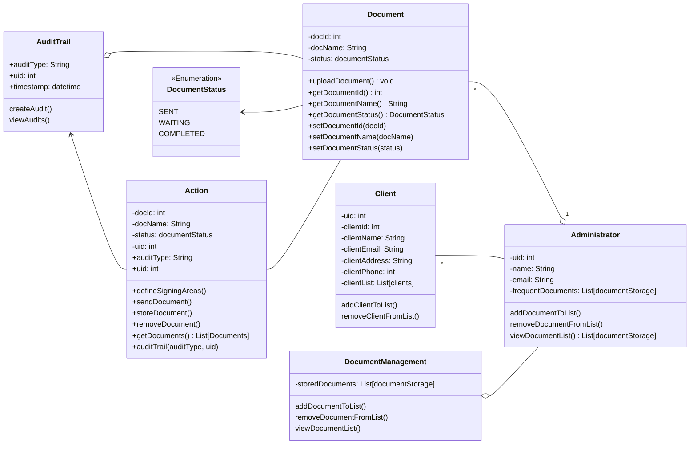

# Cheetah Sign Domain Model

## Diagram

## Classes

### Document

The document class represents the documents that have been uploaded. You can get and set document ID, name, and status.

### Action

The Action class contains everything you will need to perform actions on the documents.

### DocumentManagement

This is where the document management operations will take place. Administrators will be able to utilize this class and their methods.

### AuditTrail

This class represents keeping track of all actions on documents to form an audit trail. It will keep track of audit type, the user who made the audit, and timestamps.

### Administrator

The Administrator class represents the main users of the system. They will be able to utilize the Document Management class. They can store, remove, and view their frequently used documents for easier access.

### Client
