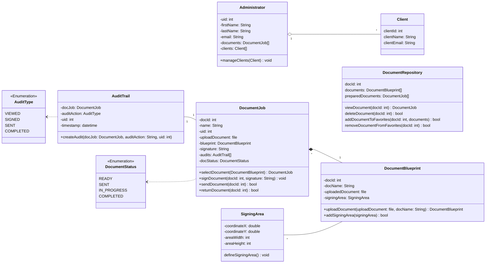

# Cheetah Sign Domain Model

This is a diagram and description that represents the Cheetah Sign system.

## Diagram

## Classes

### Administrator

The Administrator class represents the main users of the system. Every admin in the system will share the same pool of uploaded documents from a 'document repository'. Admins will be able to manage their clients information. Eventually we want to provide a login feature so each admin can have their own customization like favorited documents.

### DocumentBluePrint

The Document Blueprint class represents the place where all documents will be created. The admin can upload their document and prepare it by giving it a name and setting the areas that needs to be signed by the designees. After doing this the document can become a 'document job'.

### SigningArea

The SigningArea class is used to specify exactly where the designees need to sign. This will be done by marking coordinates of the page and setting a width and height of the text box.

### DocumentJob

The DocumentJob class represents the documents after they have been uploaded and prepared. It becomes a job because the documents can be signed, sent, returned, etc. All document jobs will have an audit trail to keep track of the actions performed on the documents.

### AuditTrail

The AuditTrail class is responsible for logging all actions performed on document jobs to form an audit trail. It uses an enum that contains audit type values to keep track of the audit type, the user who made the audit, and the time it happened.

### Client

The Client class will be used by administrators to save their client's information.

### AuditType

This class is an enumeration that defines the various audit types whenever an action on a document takes place. This will help to keep a trail of all document audits. The possible audit types include:
 
**SENT**: Indicates that the document has been sent to the designees.
 
**VIEWED**: Indicates that the designee has opened the document.
 
**SIGNED**: Indicates that the designee has signed the document
 
**COMPLETED**: Indicates that all actions related to the document are finished and it is fully processed.

Some audit types might be modified or added in the future depending on our requirements.

### DocumentStatus

This class is an enumeration that defines the various statuses that a document can have throughout its lifecycle. Each status represents a specific state of the document, allowing for tracking each step it is on. The possible statuses include:
 
**READY**: Indicates that the document has been finalized and is ready for sending/signing.
 
**SENT**: Indicates that the document has been sent to the designees.
 
**IN_PROGRESS**: Indicates that the document has been opened by the designee.
 
**COMPLETED**: Indicates that all actions related to the document are finished and it is fully processed.

Some statuses might be modified or added in the future depending on our requirements.
