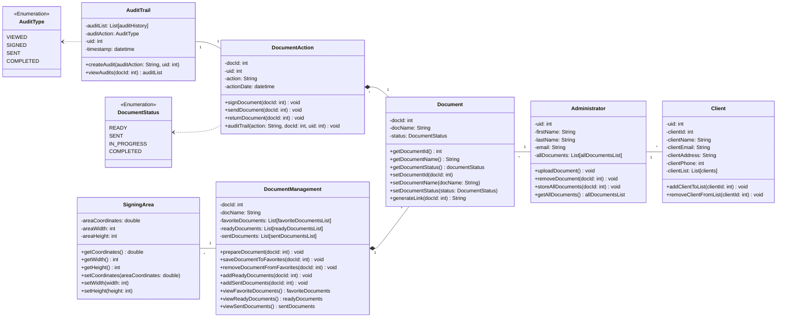

# Cheetah Sign Domain Model

This is a diagram and description that represents the Cheetah Sign system.

## Diagram

## Classes

### Administrator

The Administrator class represents the main users of the system. This is where the documents will first be uploaded by the admin. We want to provide a login feature so each admin has their own documents and customization. All documents, actions, and audit trails are saved to each admin user.

### Document

The document class represents the place where all documents will start. This is where you the document's id, name, and status will be set. Document has a parent-child relationship with the DocumentManagement and DocumentAction classes.

### DocumentAction

The DocumentAction class contains everything you need to use your documents. You can sign, send, and return documents here. Also, this is where you audit trail will be logged depending on the action you perform. The DocumentAction class holds a relationship with the AuditTrail class to log audits.

### DocumentManagement

This is where you will be managing your documents in various ways. In our system, we want to be able to sort documents depending on their status. For example, documents that are ready for sending and documents that have been sent. Furthermore, we want to offer some customization for the Administrator by letting them favorite frequently used documents.

### AuditTrail

The AuditTrail class is responsible for logging all actions performed on documents to form an audit trail. It will keep track of audit type, the user who made the audit, and the time it happened.

### SigningArea

The SigningArea class is the last piece of the document management. This class will be used to specify exactly where the designees need to sign by marking coordinates of the page.

### Client

The Client class will be used by administrators to save their client's information.

### AuditType

This class is an enumeration that defines the various audit types whenever an action on a document takes place. This well help keep a trail of all document audits. The possible audit types include:
 
**SENT**: Indicates that the document has been sent to the designees.
 
**VIEWED**: Indicates that the designee has opened the document.
 
**SIGNED**: Indicates that the designee has signed the document
 
**COMPLETED**: Indicates that all actions related to the document are finished and it is fully processed.

Some audit types might be modified or added in the future depending on our requirements.

### DocumentStatus

This class is an enumeration that defines the various statuses that a document can have throughout its lifecycle. Each status represents a specific state of the document, allowing for tracking each step it is on. The possible statuses include:
 
**READY**: Indicates that the document has been finalized and is ready for sending/signing.
 
**SENT**: Indicates that the document has been sent to the designees.
 
**IN_PROGRESS**: Indicates that the document has been opened by the designee.
 
**COMPLETED**: Indicates that all actions related to the document are finished and it is fully processed.

Some statuses might be modified or added in the future depending on our requirements.
