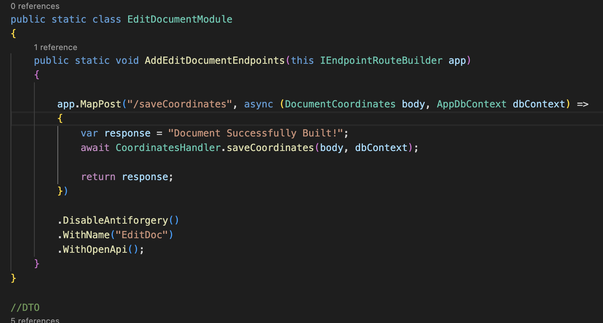
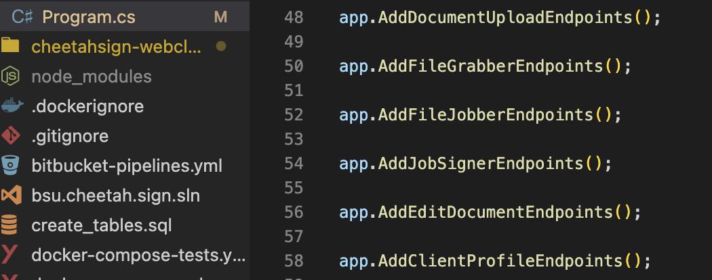
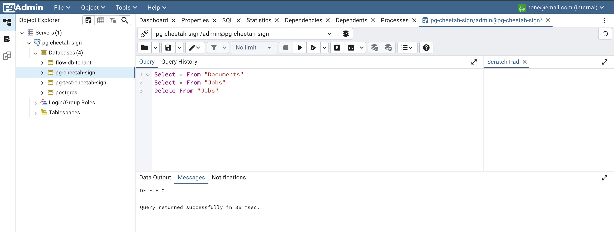
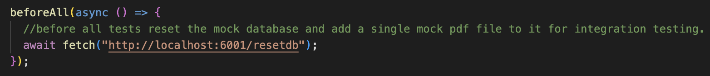

# Setup of the Development Environment

## Overview

This project is built with Vue.js + TypeScript, .NET w/ C#, and PostgreSQL. It has been fully containerized with Docker. You can run the environment with a single command using 'docker compose up', or right-clicking the Docker Compose file with the VS Code Docker Extension. This documentation will go over the replication of the development
environment using Docker.

If any problems occur during this process you can email rileyjamison2001@gmail.com for assistance.

## Prerequisites

### Cloning the Repository

You will need to access and clone the repository containing the source code. Our repository can be
found here:
https://bitbucket.org/accutechcapstone/bsu.cheetah.sign/src/main

Once you're on the repository you can click 'Clone'. This will give you a
link you can use to clone into the repository.

After copying the link, open your terminal or IDE and cd into your directory
of choice. Once in your directory, paste the link to clone the repository. If
you run into any access errors you can get assistance by reaching out to
gabe.chandler@trustasc.com.

Once you have cloned into the repository, you will see
two project folders - Cheetah.Sign.Api (backend) and cheetahsign-webclient (frontend) and two [Docker Compose](https://docs.docker.com/compose/) files.

### Installation Prerequisites

In order to run the application, you will need the following installed:

- [Docker Desktop](https://www.docker.com/products/docker-desktop/). This software lets you build and run your containerized applications.

- IDE of your choice (we opted to use [Visual Studio Code](https://code.visualstudio.com/)
  with the Docker Compose Extension)

- Frontend:

  - [Node.js 20](https://nodejs.org/en)
  - [Vue 3](https://vuejs.org/)
  - [Vite 5](https://vite.dev/)

- Backend:
  - [.NET 8 SDK](https://dotnet.microsoft.com/en-us/)

## Replicating via Docker

### Building The Docker Containers

Open your preferred IDE and your Docker Desktop application. We are using VSCode, so you will want to install the [Docker Extension](https://code.visualstudio.com/docs/containers/overview) to run it in the way presented. Now, right click on the docker-compose.yml file and select "compose up" (you can also run this command in the terminal). This can take some time to build your containers.

**Note: If this fails with an authentication error, you might have to login to your Docker account in the Visual Studio Code terminal to connect them.**

The command is:
docker login -u \<username\>

You will then be asked for your Docker password. (you will not see your password as you type it in)

You will know if the build was successful when your container names appear in your terminal and
Docker spins up 4 images:

- sign-pgdata
- sign-pgadmin
- sign-api
- bsucheetahsign-cheetahsign-webclient-1

This is how it will appear on Docker Desktop:

### Editing the Frontend

Everything relating to the frontend for administrators will be found in the 'cheetahsign-webclient' directory. For now, the page where users will sign documents lies in this directory as well. DefaultLayout.vue is the template page that all of our components inherit from except for the Document Builder and Signing Page. This also contains our [Vue Router](https://router.vuejs.org/) to allow for navigation between different parts of the application.

Vue follows a component-based architecture. So, everything we make on the frontend is based around our components. Each of our different sections in our webpage is a separate component. For example, if you were to need an upload form for 2 different parts of the application, you wouldn't need to make 2 separate forms in each of the Vue files. Instead, you could make one upload form and each component could inherit it into their own Vue file. This is how you use Vue to work with the frontend.

Another piece of the frontend puzzle are the API calls that are made to talk to our backend. The way this is done falls into our 'sdk' folder in the webclient directory. Each of the classes located in these 'client' files contain a variety of asynchronous methods that we can call in our Vue components. If they're HTTP GET requests, they just contain the endpoint to talk to the backend. If they're an HTTP POST request, they also will contain a body to be sent. For example, if you were sending a file to the backend, you would define a body of Form Data that contains your file. It would then be sent with your POST request and the backend will receieve it. Once the backend has it you could manipulate the file or even save it to the database.

### Editing the Backend (Endpoints + Endpoint Services)

Everything relating to the backend will be found in the Cheetah.Sign.Api directory. Primarily, you will be editing the files within the 'Endpoints' and 'endpoint-services' directories, where the HTTP POST and GET requests will be sent.

Use this directory to edit the current endpoints or create new files with new endpoints. With the creation of new endpoints, they must be defined in the 'Program.cs' file. A basic example shows us making a method 'AddEditDocumentEndpoints' with a POST request contained. This POST request contains an endpoint that cooresponds to one of the endpoints defined in our 'client' TypeScript file's async methods mentioned earlier. This POST request has a response it returns and it calls an endpoint service to save the coordinates to the database.

### Editing the Backend (PostgreSQL Database)

If you want to edit the database, refer to the Contexts folder with the file [AppDbContext](https://sbelialov.medium.com/quick-and-easy-dbcontext-setup-in-net-70e2211be8f4). This file is used to define
your database tables and fields, and it must coorelate with the actual database server setup. You can define and edit our Postgres database server tables within the 'sign-pgadmin' port on Docker (you can find the login info in the docker compose file under pg-admin). This will take you to [pgAdmin](https://www.pgadmin.org/), a development platform for PostgreSQL. However, your tables should automatically be created when you run the application. These are based off our latest [database migrations](https://learn.microsoft.com/en-us/ef/core/managing-schemas/migrations/?tabs=dotnet-core-cli) found in the 'migrations' folder.

To actually perform database operations, we use [Microsoft Entity Framework](https://learn.microsoft.com/en-us/aspnet/entity-framework) - an object-relational mapper. Entity Framework provides a seamless and efficient way to interact with a database by allowing you to work with them using C# objects. It works directly with the AppDbContext we mentioned ealier. These operations can be found in our 'Endpoints' directory.

## Accessing the Application & How to Test

Once you have Docker Desktop running the containers for the API, Postgres, and the web client,
you can access the application. Navigate to the URL http://localhost:8080/

To test if the application is running
correctly, attempt to upload a document. If the
table populates with your file, your environment is set up correctly. You could also try running the unit and integration tests.

## Unit & Integration Testing

Cheetah Sign is being tested with both unit tests and integration tests ([read about the difference between these two here](https://circleci.com/blog/unit-testing-vs-integration-testing/)). For the frontend we are using [Vitest](https://vitest.dev/) with [Mock Service Worker](https://mswjs.io/), and on the backend we are using [Xunit](https://xunit.net/) with a mock PostgreSQL database. Both of these have test coverage tools we use as well. The frontend unit and integration tests are found in their 'unit-tests' and 'integration-tests' directories respectively. The backends unit tests are contained in the 'UnitTests' directory, and the mock PostgreSQL databases lie in the 'Contexts' directory. We have two mock databases - one for the backend unit tests and another for the integration tests that start at the frontend.

Here are the different commands to run tests. You either have to be in the webclient or API directory for these to run:

Frontend (webclient directory):

- 'npm test' for frontend unit tests
- 'npm run coverage' for frontend test coverage
- 'npm run integration' for integration tests

Backend (API directory):

- 'dotnet test' for running backend unit tests
- 'dotnet-coverage collect dotnet test -f xml' for backend test coverage
- 'reportgenerator -reports:"output.xml" -targetdir:"coveragereport" -reporttypes:Html' for generating a test coverage report

You should be able to open the newly created index.html report in the 'coveragereport' folder.

### Running Integration Tests

To run the unit tests for the backend and frontend, you're good just to build the application and enter the commands. However, the integration tests require a bit more setup first.

If you remember earlier, we mentioned that this project contains two [Docker Compose](https://docs.docker.com/compose/) files. The main Docker Compose, 'docker-compose.yml', is what is used to run the main application (and it's run by default when running the docker compose up command). The 'docker-compose-test.yml' file is used for running our integration tests. **This compose MUST be running to successfully run our integration tests**. This Docker Compose stack makes sure that the backend runs our mock database an not our development/production database. To run this specific Docker Compose, use the command 'docker-compose -f docker-compose-tests.yml up'. You will then be good to run 'npm run integration' to start the integration tests.

The Vitest integration test files are a little bit more complicated than the normal unit tests. Essentially, we are calling an endpoint before every integration is ran. This endpoint clears the database (to always start the tests with a fresh mock database) and saves one mock document to the mock database. The one document being in the database is crucial for the tests to actually test how our frontend and backend interact.

## Project & Folder Structure

### Frontend (cheetahsign-webclient)

- Components
   
  This contains all of our Vue components. Components are reusable pieces of code that encapsulates a specific part of the UI. These contain the different sections of our application. For example, our upload form modal, tables for displaying uploaded documents, Document Builder, etc.

- SDK
   
  This contains all of the classes that hold our asynchronous methods to allow us to communicate with our backend. For example, when making a POST request to upload a document, we create an asynchronous method that takes an argument of FormData and a return type (a string in our case). We define our endpoint and our argument (request) is used as the POST body. This is then sent to the backend.

- Service-Base
   
  Within our SDK folder, our service base folder contains our service base file and our axios setup file. These are both an integral part of our application. Axios is a popular JavaScript library used for making HTTP requests. Our service base file adds to that and is like a template that iss designed to help us reuse HTTP methods across other classes, avoiding duplication of code.

  Service-Base also contains our 'vuex.ts' file. This file is using a Vue library called Vuex, which is a state management library. We use it primarily for reactively updating our UI when a document is uploaded, so you don't have to refresh the page to see the changes.

### Backend (Cheetah.Sign.Api)

- Endpoints
   
  Our Endpoints folder contains the files and classes that receive the HTTP requests from the frontend (see SDK folder), does a database operation, and returns a response. This file also contains our [Data Transfer Objects (DTO)](https://learn.microsoft.com/en-us/aspnet/web-api/overview/data/using-web-api-with-entity-framework/part-5), these are used to transfer data between the frontend and backend. Each endpoint calls an endpoint service file to carry out various actions.

- Endpoint-Services
   
  These files are called by all of the Endpoints files. Each of these contain a class and methods that usually perform a service for the endpoints. For example, when uploading a document, the backend receives it in the 'UploadDocumentModule.cs' file at the /upload endpoint and calls 'UploadDocument.cs'. This file acts as a service and converts the uploaded document to a byte array format so it can be saved to the database. UploadDocument.cs returns the file in byte array format back to the /upload in 'UploadDocumentModule' and it then carries out the database operation to save the file.

- Edit-Documents
   
  The Edit Document folder is a very important part of the application. This is where the text boxes are added when a document is built and rendered, and where recipient input is added when a document is signed. These two main methods use [iText Core](https://itextpdf.com/products/itext-core), a C# library used for creating and manipulating PDFs.

- Migrations
   
  The Migrations folder contains our migrations that come from our Microsoft Entity Framework setup. Migrations represent changes to your database schema over time and provide a way to apply or revert those changes. Think of them like a version control for your database structure.

- Contexts
   
  This is another piece of our Microsoft Entity Framework setup. This folder contains our AppDbContext, which is a class that serves as a bridge between your application and the database. It is responsible for managing your database tables and fields. This also contains the mock PostgreSQL databases that are used in backend unit testing and integration testing.

### Important Files

- docker-compose.yml & docker-compose-tests.yml
   
  Like mentioned before, our docker-compose.yml is used for running our main application. The docker-compose-tests.yml is only used for running the integration tests. We need this extra Docker Compose file so it can spin up our mock PostgreSQL database rather than our development/production database. These files contain everything you need to run our application by simpling using the command 'docker compose up'.

- Program.cs
   
  These files are where we configure our connections to our database, enviroment variables, our HTTP request pipeline,
  automatic database setup, and define our endpoint methods, etc.

- PgDataFixture.cs & PgDataFixtureIntegration.cs
   
  These files contain our mock databases. One used for backend unit testing and the other used for intergation testing.

- AppDbContext.cs
   
  This file contains our AppDbContext, which is a class that serves as a bridge between your application and the database. It is responsible for managing your database tables and fields.

- main.ts
   
  This file is used to initialise the root component of our Vue application. It's basically where the app starts running. It is used for registering plugins (like Vue Router, Vuex, PrimeVue, etc.). Since we use stuff like the UI library [PrimeVue](https://primevue.org/) and the library [Vue Router](https://router.vuejs.org/), we must register these plugins globally for our app.

- App.vue & DefaultLayout.vue
  App.vue contains the root component of a Vue app. it is like the main template that your entire UI builds off of. In our case, we want a basic header UI template to be used in all of the sections of our application except for the signing page and Document Builder page. So, we use DefaultLayout.vue to contain that UI with the navbar template, and then we have an empty UI for those other two pages.
   
