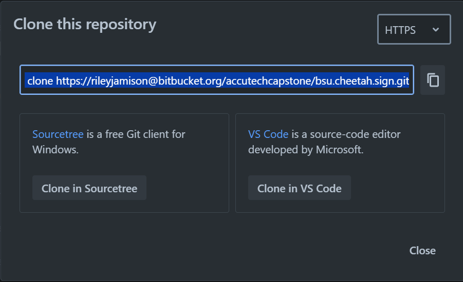
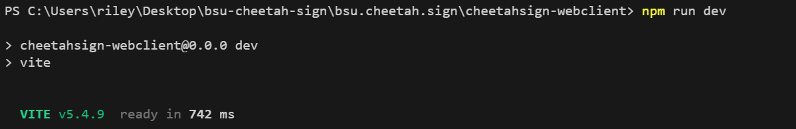
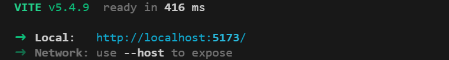
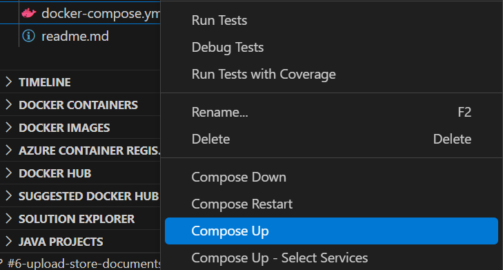
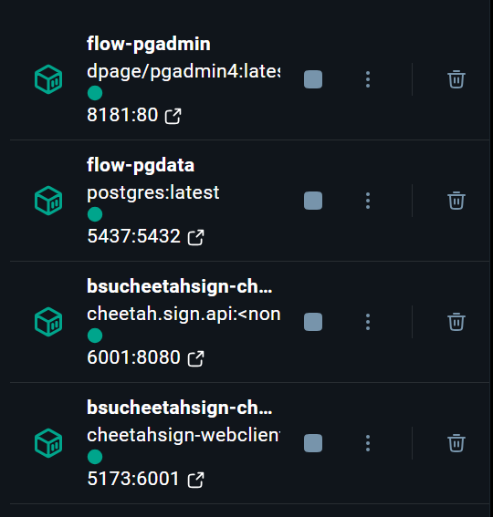
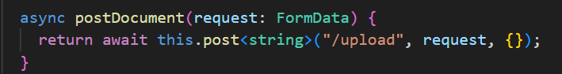

# Setting up the Development Environment

## Overview

This project is run with a node.js web server and is Dockerized. This documentation will go over the replication of the development
environment using Docker. We were provided with a template that already had the Postgres database and API Dockerized, but not the frontend. This project has two sections - the web server and the api. Both need to be ran at the same
time for a proper dev environment.

This documentation expects that you are setting up the dev environment on a Windows computer.
If any problems occur during this process you can email riley.jamison@bsu.edu for assistance.

## Prerequisites

### Cloning the Repository

You will need to access and clone the repository containing the source code. Our repository can be
found here:
https://bitbucket.org/accutechcapstone/bsu.cheetah.sign/src/main

Once you're on the repository you can click 'Clone'. This will give you a
link you can use to clone into the repository.

After copying the link, open your terminal or IDE and cd into your directory
of choice. Once in your directory, paste the link to clone the repository. If
you run into any access errors you can get assistance by reaching out to
riley.jamison@bsu.edu.

Once you have cloned into the repository, you will see
two projects - Cheetah.Sign.Api (The Back-end)
and cheetahsign-webclient (The Front-end).

### Installation Prerequisites

In order to run the program, you will need the following programs already installed:

- Install [Docker Desktop](https://www.docker.com/products/docker-desktop/). This application lets you build and run your containerized applications.

- IDE of your choice with the ability to docker compose (When writing this documentation, we opted to use Visual Studio Code
  with the Docker compose Extension)

- Front-end:

  - Node.js 20
  - Vue 3
  - Vite 5

- Back-end:
  - .NET 8 SDK
  - [Docker Desktop](https://www.docker.com/products/docker-desktop/)

## Replicating via Docker

### First Time Frontend Setup

At the time of this writing we have Dockerized the frontend as well, but there is a bug that causes the frontend to not take any API calls. There is an issue with how each of the Docker containers communicate with each other. To run the fully functional application, follow these steps to run your Vite development server from your IDE terminal first, and then run the Docker containers for the backend. To run the fully dockerized version continue to [Running the Backend](Development.md#building-the-docker-containers).

Open up windows powershell or IDE terminal and navigate to the directory where the source code is stored. Navigate into the
"cheetahsign-webclient" directory.

Run 'npm install'.

This will install the Vite + Vue client that runs the front end.

### Running the Frontend

Open up windows powershell or IDE terminal and navigate to the directory where the source code is stored. Navigate into the
"cheetahsign-webclient" directory.

Run 'npm run dev'. This will run the Vite + Vue development server. In your terminal you will be given
a link with a port number to access the localhost development server.

The terminal will display commands. Most importantly, you will use

- R + enter - Restarts the website.
- O + enter - Opens the website on your default web browser.
- Q + Enter - Quits the service.

### Editing the Frontend

Everything relating to the front end will be found in the 'cheetahsign-webclient' directory. By default, the app will run
the App.vue file.

App.vue is a file that inherits HelloWorld.vue, which inherits DailyForecast.vue. You can modify these Vue files to
begin work, or you may make a new Vue file.

When making a new Vue file, ensure that you edit 'main.ts' to open your newly made
Vue file instead of the old one. You can do this by editing the directory from './App.vue' to the directory of your newly
made vue file.

### Building The Docker Containers

Open your preferred IDE with the ability to docker compose and your Docker Desktop application. We are using VSCode so you will want to install the [Docker Extension](https://code.visualstudio.com/docs/containers/overview) to run it in the way presented. Now you should right click on the docker-compose.yml file and select "compose up". This can take some time to build your containers.

You will know if the build was successful because your container names will appear in your terminal and
Docker Compose will spin up 4 images:

- pgdata
- pgadmin
- cheetah.sign.api
- cheetahsign-webclient

This is how it will appear on Docker Desktop:

## Setting Up Postgres (pgadmin)

The pgdata container will expose a specific port that you can use to setup your database server,
so that the API can connect to the database. To setup your database, go to the port
running on 'pgadmin'. In this case it is http://localhost:8181. This will take you to the
pgadmin website where you can login and manage your databases. Reference the
Docker Compose file to find your login credentials and database information. Once
you are logged in you can create a database server by right clicking on your server group
and clicking 'Register Server'.

 
After clicking register, you will be shown a configuration pop-up. Name your database and then going into the
connection tab. This is where you will enter the information from the Docker Compose file. The
Host Name should be 'flow-pgdata', Port should be '5432', Username should be 'admin',
and Password should be 'secret'. After saving you should be able to create your tables.

We are using Microsoft's Entity Framework to connect to PostgreSQL.
This requires a few configurations in your project.
Before attempting to use the application, run 'dotnet restore' in your terminal
within the Cheetah.Sign.Api directory. This is to make sure
you have all necessary packages and your enviroment
will have the correct dependencies and project-specific tools.

### Setting Up PostgreSQL Tables (pgadmin & EF)

There are two parts to setting up the our tables
when using Microsoft's Entity Framework. First is
in pgadmin and second is in your C# code. We have the latter already setup!

At the time of this writing, we are using two tables for our application. For the first one, create a table named 'Documents' with the first column, a primary key, being 'Id' with the type Serial,
the second column being 'Name' with the type text, and the last column being 'File' with
the type bytea.

For the second one, create a table named 'Jobs' with the first column, a primary key, being 'Id' with the type Serial,
the second column being 'FileName' with the type text, the third column being
'ClientName' with the type text, and the last one being 'Status' with the type text.
If there are problems don't forget to check if the tables are defined in the code as well, located in 'AppDbContext'!

### Editing the Backend

Everything relating to the back end will be found in the Cheetah.Sign.Api directory. Primarily, you will be editing the
files within the Endpoints directory, where the HTTP POST and GET requests will be sent.

Use this directory to edit the current endpoints or create new files with new endpoints. With the creation of new endpoints,
ensure that you add the new endpoints to the 'Program.cs'.

If you want to edit the database, refer to the Contexts directory with the file 'AppDbContext'.

## Accessing the Application & How to Test

Once you have the frontend development server running and Docker is running the container with the API and Postgres images,
you can access the application. Click the link that is given to you when running
'npm run dev'. This will be a localhost URL with a port number. To test if the application is running
correctly, attempt to upload a document. After uploading click the 'refresh files' buttons. If the
list under 'Uploaded Documents' populates with your file, your enviroment is setup correctly.

## Project & Folder Structure

### Frontend (cheetahsign-webclient)

- Components
   
  This contains all of our Vue components. Components are reusable pieces of code that encapsulates a specific part of the UI. As of now these contain the different parts of our page. We have one for our weather forecast and document uploading form.

- Service-Base
   
  Within our SDK folder, our service base folder contains our service base file and our axios setup file. These are both an integral part of our application. Axios is a popular JavaScript library used for making HTTP requests. Our service base file adds to that and is like a template. In our case, it is designed to help us reuse HTTP methods across other classes, avoiding duplication of code.

- Upload
   
  Our upload folder contains our data models (interfaces) and our Upload document client. Our Upload document client extends our service base and is used to setup our HTTP requests. For example, when doing a post request we make an asynchronous method that takes an argument and a return type (a string in our case). We define our endpoint and our argument is used as the post body. This is then sent to the backend.

### Backend (Cheetah.Sign.Api)

- Endpoints
   
  Our Endpoints folder contains the file that receives the requests from the frontend and returns a response. This file also contains our Data Transfer Objects (DTO), these are used to transfer data between different parts of an application.

- Migrations
   
  The Migrations folder contains our migrations that come from our Microsoft Entity Framework setup. Migrations represent changes to your database schema over time and provide a way to apply or revert those changes. Think of them like a version control for your database structure.

- Contexts
   
  This is another piece of our Microsoft Entity Framework setup. This folder contains our AppDbContext, which is a class that serves as a bridge between your application and the database. It is responsible for managing your database tables and data.

### Important Files

- Program.cs & appsettings.json
   
  These files are where we configure our connections to our database, enviroment variables, our HTTP request pipeline, etc.
