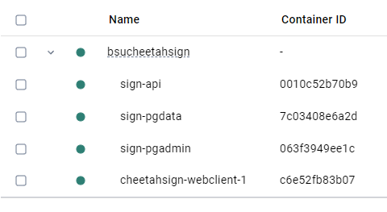

# Setting up the Development Environment

## Overview

This project is run with a node.js web server and in a docker container. This documentation will go over the creation of the
environment in two sections - setting up the web server and setting up the api. Both need to be ran at the same
time for a proper dev environment.

This documentation expects that you are setting up the dev environment on a Windows computer.

## Prerequisites

You will need access to the repository containing the source code. It contains two projects - Cheetah.Sign.Api (The Back-end)
and cheetahsign-webclient (The Front-end).

In order to run the program, you will need the following programs already installed:

- IDE of your choice with the ability to docker compose (When writing this documentation, we opted to use Visual Studio Code
  with the Docker compose Extension)

- Front-end:

  - Node.js
  - Vue
  - Vite

- Back-end:
  - .NET 8 SDK
  - Docker Desktop

## Front End Setup

### First Time Setup

Open up windows powershell or IDE terminal and navigate to the directory where the source code is stored. Navigate into the
"cheetahsign-webclient" directory.

Run 'npm install'.

This will install the Vite + Vue client that runs the front end.

### Running the Application

Open up windows powershell or IDE terminal and navigate to the directory where the source code is stored. Navigate into the
"cheetahsign-webclient" directory.

Run 'npm run dev'. This will run the Vite + Vue website.

The terminal will display commands. Most importantly, you will use

- R + enter - Restarts the website.
- O + enter - Opens the website on your default web browser.
- Q + Enter - Quits the service.

### Editing the Application

Everything relating to the front end will be found in the 'cheetahsign-webclient' directory. By default, the app will run
the App.vue file.

App.vue is a file that inherits HelloWorld.vue, which inherits DailyForecast.vue. You can modify these Vue files to
begin work, or you may make a new Vue file.

When making a new Vue file, ensure that you edit 'main.ts' to open your newly made
Vue file instead of the old one. You can do this by editing the directory from './App.vue' to the directory of your newly
made vue file.

## Back End Setup

### Running the Application

Open your preferred IDE with the ability to compose. You should run the "docker-compose" startup option.
(You can also right click on the docker-compose.yml file and select "compose up".)

Docker composing will spin up 3 images:

- cheetah.sign.api
- pgdata
- pgadmin

This will run the api and you can start uploading and viewing your documents.

The pgdata container will expose a specific port that you can use to setup your database server, so that the API can connect to the database.

### Editing the Application

Everything relating to the back end will be found in the Cheetah.Sign.Api directory. Primarily, you will be editing the
files within the Endpoints directory, where the HTTP POST and GET requests will be sent.

Use this directory to edit the current endpoints or create new files with new endpoints. With the creation of new endpoints,
ensure that you add the new endpoints to the 'Program.cs'.

## Project & Folder Structure

### Frontend (cheetahsign-webclient)

- Components
   
  This contains all of our Vue components. Components are reusable pieces of code that encapsulates a specific part of the UI. As of now these contain the different parts of our page. We have one for our weather forecast and document uploading form.

- Service-Base
   
  Within our SDK folder, our service base folder contains our service base file and our axios setup file. These are both an integral part of our application. Axios is a popular JavaScript library used for making HTTP requests. Our service base file adds to that and is like a template. In our case, it is designed to help us reuse HTTP methods across other classes, avoiding duplication of code.

- Upload
   
  Our upload folder contains our data models (interfaces) and our Upload document client. Our Upload document client extends our service base and is used to setup our HTTP requests. For example, when doing a post request we make an asynchronous method that takes an argument and a return type (a string in our case). We define our endpoint and our argument is used as the post body. This is then sent to the backend.

### Backend (Cheetah.Sign.Api)

- Endpoints
   
  Our Endpoints folder contains the file that receives the requests from the frontend and returns a response. This file also contains our Data Transfer Objects (DTO), these are used to transfer data between different parts of an application.

- Migrations
   
  The Migrations folder contains our migrations that come from our Microsoft Entity Framework setup. Migrations represent changes to your database schema over time and provide a way to apply or revert those changes. Think of them like a version control for your database structure.

- Contexts
   
  This is another piece of our Microsoft Entity Framework setup. This folder contains our AppDbContext, which is a class that serves as a bridge between your application and the database. It is responsible for managing your database tables and data.

### Important Files

- Program.cs & appsettings.json
   
  These files are where we configure our connections to our database, enviroment variables, our HTTP request pipeline, etc.

## How to Test
