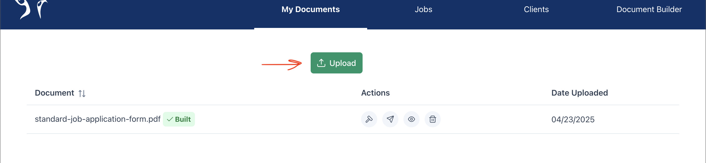

# User Manual

## Admin

Admins are in control of most of the functionality for Cheetah Sign. You have access to the admin side of the website, where
you will be able to:

- Upload Documents
- View Uploaded Documents
- Edit Documents for Signing
- Send Documents to Clients
- View the Status of Sent Documents

### Upload Documents

In order to send a document to a client, you must first upload it. You can do this by clicking the upload butotn found at the
bottom of the admin home page.
This button will take you to a
modal pop-up with a browse files
button. Select the button to open up your local file browser, and select the .PDF file that
you would like to upload. Cheetah Sign has been designed and tested with .PDF files only, and it is best for to try
and stick to those files.

  

After selecting your .PDF file, click the blue upload button. The file should be uploaded to the server and can be used. After
uploading the file, it is a good idea to reload the page.

### View Uploaded Documents

All uploaded files can be found under the "Uploaded Documents" table found in the middle of the Home page and Document Editor page. Each document is listed
with the following attributes from left to right:

- The document name
- A text box for the client name
- A text box for the client email
- A view button
- A send button
- An edit button
- A delete button

Currently if you want to view a document, you can go to the Document Editor and click 'edit' to render the PDF.

### Edit a Document

You don't want to just send your plain PDF to your clients, correct?
You want to have a spot where they
can provide their e-signature. This is where the Document Editor comes in. With this feature you are able to specify where you want your text boxes to be on your PDF by providing x and y coordinates. Navigate to the Document Editor section of the website by using the nav bar. You will see input boxes for coordinates, and below that, a list of your documents. Click the 'edit' button to render your PDF on the web page. Add in your coordinates and click 'Submit Edit'. You should get a success message and a red box on your PDF to preview where the text box will be added. The Document should be saved to your document list with 'Edited' added to the beginning of the name. So, if you refresh your files, you should be able to view your new document with the added text box!

### Send Documents to Clients

Looking at the table of uploaded documents, you are able to create a "Job". A "Job" is an instance of a document that contains
a client and a status determining the state of the document. You can create a Job by filling out the client email text box and
selecting the "Send" button. You should reload the page after making a job.

You can create as many Jobs as you'd like from a single document by continuing to select the Send
button. This is helpful when sending a single document to several clients, such as an NDA to a new team of hires.

### View the status of sent documents

All sent Jobs can be found at the top of the page. It details the document name, the client, and the status of the job. If
a document has been signed by the client, it will be marked with the status "signed". Otherwise, it will be marked with the
status "sent".

Each job in the table also has its own view button, allowing for you to view the document, similar to the view button on the
list of uploaded documents.

## Client

As a client, you will have the ability to:

- View Documents sent to you
- Sign Documents

### View Documents sent to you

As of now we're using Ethereal Email for testing our document sending. Ethereal provides temporary, disposable email addresses that are used for testing purposes rather than for permanent or personal communication. So, we are able to 'send' emails with a link to a document and view them using Ethereal.

Once you access this link, you will be taken to the client signing page. This will render your PDF and have a 'sign' button.

### Sign Documents

To sign a document you just input your name on the PDF and then click the sign button! This button updates the status of the document to signed. You should receive a success message indicating you have signed the PDF.

