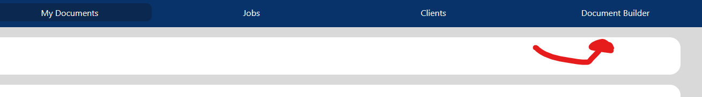

# User Manual

## Admin

Admins are in control of most of the functionality for Cheetah Sign. You have access to the admin side of the website, where
you will be able to:

- Upload Documents
- Record Client Profiles
- View Uploaded Documents
- Edit Documents for Signing
- Send Documents to Clients
- View the Status of Sent Documents
- View the Audit Trail of Sent Documents

### Upload Documents

In order to send a document to a client, you must first upload it. You can do this by clicking the upload button found at the
top of the "My Documents" page.
This button will take you to a
modal pop-up with a browse files
button. Select the button to open up your local file browser, and select the .PDF file that
you would like to upload. Cheetah Sign has been designed and tested with .PDF files only, and it is best for to try
and stick to those files.

  

After selecting your .PDF file, click the blue upload button. The file should be uploaded to the server and can be used. After
uploading the file, it is a good idea to reload the page.

### View Uploaded Documents

All uploaded files can be found under the "My Documents" table found in the middle of the Home page and Document Editor page. Each document is listed
with the following attributes from left to right:

- The document name
- A text box for the client name
- A text box for the client email
- A send button
- A view button
- A delete button

Currently, if you want to view a document, you can go to the Document Editor and click 'edit' to render the PDF.

### Edit a Document

Editing a document allows you to place a text box, indicating where you would like the user to input their information.
After you have uploaded a sample document, navigate to the "Document Builder" tab.

Once here, you'll be able to view the document builder! The document builder lists off your documents on the left. Click on a
document to pull it up on the right. From there, you can click directly on the document to select where you would like the
text box to be placed.

Once you've placed your text box, select the build button in the upper right corner to finalize it! A copy of your document
with the text box added will be saved.

### Recording a Client Profile

You are able to record the name and email of a client. This is useful to keep track of the information, as well as sending
documents to the same recipient multiple times. In order to create a client profile, navigate to the "Clients" page and 
click the "Add New Client" button.

A modal should open where you are able to enter the client's name and email. When entered, the client will appear in the table,
signalling that the client has been recorded. A recorded client can also be deleted as well.

### Send Documents to Clients

Looking at the table of uploaded documents, you are able to create a "Job". A "Job" is an instance of a document that contains
a client and a status determining the state of the document. You can create a Job by selecting the "send" button.

When you've selected the send button, it will open up a modal for sending the document. You have two options for sending the document:
you can enter the client's information directly, OR you can select a client that you created in the client menu.
You should select the "send" button that corresponds to the option you chose. This will use the information you've entered
to send the document to the client.

### View the status of sent documents

All sent Jobs can be found in the "Jobs" page, navigated to from the navbar. The jobs detail the document name, the client,
and the status of the job. If a document has been signed by the client, it will be marked with the status "signed". Otherwise,
it will be marked with the status "sent".

Each job in the table also has its own view button, allowing for you to view the document, similar to the view button on the
list of uploaded documents.

## Client

As a client, you will have the ability to:

- View Documents sent to you
- Sign Documents

### View Documents sent to you

As of now we're using Ethereal Email for testing our document sending. Ethereal provides temporary, disposable email
addresses that are used for testing purposes rather than for permanent or personal communication. So, we are able to
'send' emails with a link to a document and view them using Ethereal.

Once you access this link, you will be taken to the client signing page. This will render your PDF and have a 'sign' button.

### Sign Documents

To sign a document you just input your name on the PDF and then click the sign button! This button updates the status
of the document to signed. You should receive a success message indicating you have signed the PDF.

