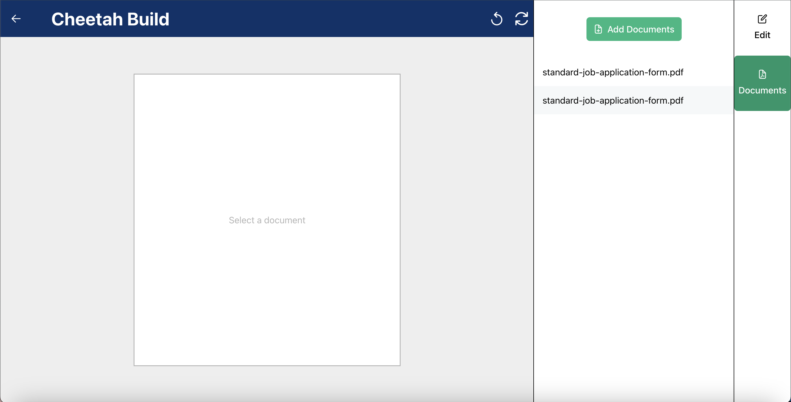

# User Manual

## Admin

Admins are in control of most of the functionality for Cheetah Sign. You have access to the admin side of the website, where
you will be able to:

- Upload Documents
- View Uploaded Documents
- Build Documents for Signing
- Add Client Profiles
- Send Documents to Clients
- View the Status of Sent Documents
- View the Audit Trail of Sent Documents
- View and Download Signed Documents

### Upload Documents

In order to send a document to a client, you must first upload it. You can do this by clicking the upload button found at the
top of the "My Documents" page.
This button will take you to a
modal pop-up with a browse files
button. Click the button or upload icon to open up your file browser, and select the PDF file that you would like to upload. Cheetah Sign currently only supports PDF files.

After selecting your PDF file, click the blue upload button. You should receieve a notification that the file has been uploaded to the server, and is ready to be built. The next step is to build this document for sending! You can either navigate to the Document Builder through the Toast notification, or click one of the two Document Builder buttons.

### After Uploading

All uploaded files can be found in the "My Documents" section of the application and in the 'Documents' section of the Document Builder page. Each document is listed
with the following attributes from left to right:

- Document Name w/ a tag indicating if it has been built (Can filter alphabetically)
- Build Template Button
- Send Document Button
- View Document Button
- Delete Document Button
- Upload Date

We will go though each of these core actions.

### Introducing Cheetah Build

Building a document with Cheetah Build allows you to place text boxes on a PDF, indicating where you would like the user to input their information.
After you have uploaded a base document, navigate to the "Document Builder" tab in one of the three ways mentioned before.

Once here, you'll be able to view the Cheetah Document Builder! The Document Builder contains two tabs - 'Edit' and
'Documents'. Under 'Documents' you can select one of the documents you have previously uploaded and it will be rendered in the gray zone. Under 'Edit' you will be presented with the name of your document, the number of pages, and your options of input types.

### Cheetah Build Drag and Drop

To build a document in Cheetah Build, we provided a drag and drop functionality to give admins flexibility in their building process. All you have to do is select a document you want to build, drag one of the input types you want, and drop it onto your rendered page. You will notice you also have an option to resize the width and height of your dropped input box - very flexible. And don't worry, if you make a mistake, you can reposition your dropped box or even undo/refresh them.

### Recording a Client Profile

Before we want to send out built document, we might want to save a client we believe we will be using often. You are able to record the name, email, phone, and address of a client. This is useful to keep track of the information, as well as sending
documents to the same recipient multiple times. In order to create a client profile, navigate to the "Clients" page and
click the "Add Client" button.

A modal should open where you are able to enter the client's information. When entered, the client will appear in the table,
signalling that the client has been recorded. A recorded client can be deleted as well.

### Viewing Documents

After uploading a document, you can select the view button on the home page to preview the document. Even better is that you can preview a document that you have just built using this feature. So, just to make sure you're happy with the built version, take a look at it before sending!

### Send Documents to Clients

Finally the time has come - actually sending your built document to a recipient! Looking at the home page which contains your table of uploaded documents, you are able to create a "Job". A "Job" is an instance of a document that contains
a client and a status determining the state of the document. You can create a Job by selecting the "Send" button and either selecting one of your existing clients, or entering their name and email.

### After Sending

All sent documents can be found in the "Jobs" section of the application. Each Job is listed
with the following attributes from left to right:

- Audit Trail Button
- Job Name (Can filter alphabetically)
- View Signed Job Button
- Download Signed Job Button
- Delete Job Button
- Recipients (Can filter alphabetically)
- Status

Each job details the document name, the recipient,
and the status of the job. Each job also provides an audit trail showing the lifecycle of the sent document. If a document has been signed by the client, it will be marked with a "Signed" green tag. Otherwise,
it will be marked with a "Sent" orange tag.

Each job in the table also has its own view button and download button. This allows for you to view or download the signed document when it is finished.

## Client

As a client, you will have the ability to:

- View Documents sent to you
- Sign Documents

### Client Viewing and Signing Documents

Once an admin decides to send a built document to a client, the client will receive the link to the document in their email.

After following this link, clients will be presented with the built document containing all text fields to input the requested information. To fill out the document, they will use a stepper component that contains text boxes labeled with the desired input. On the last step they will see a 'Finish' button. After clicking this button, a modal will appear telling them 'Thanks for signing!' with an option to download their signed document. Since the signing is complete, Admins should now be able to view and download the signed document!

