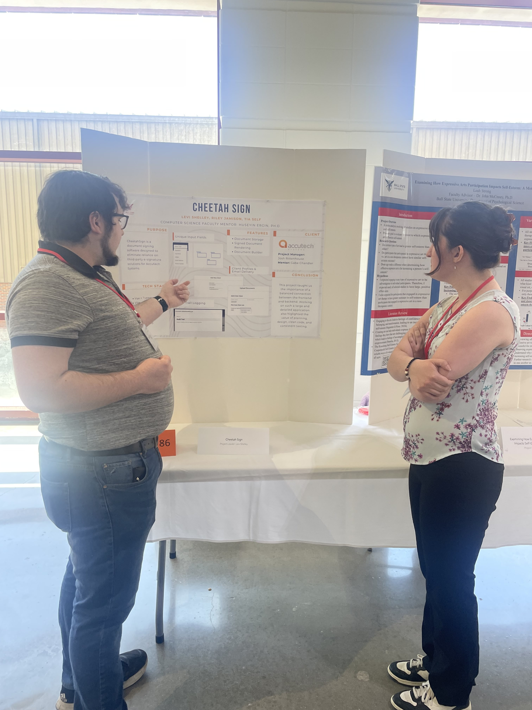
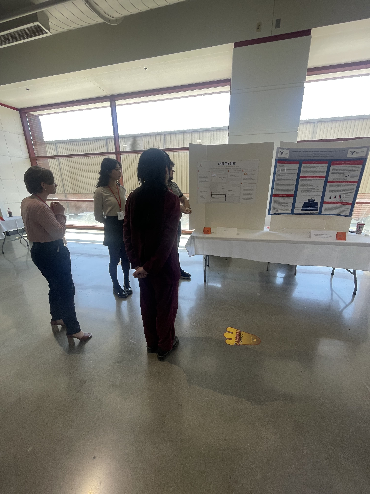
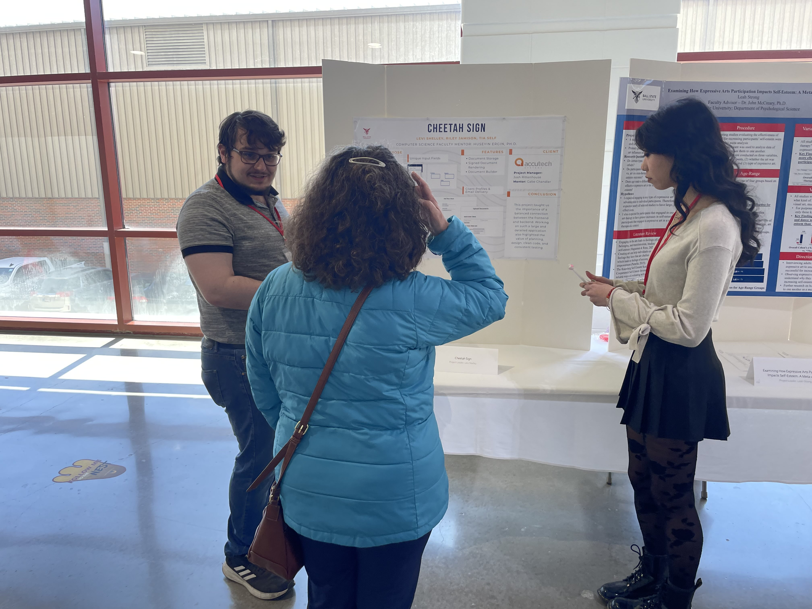
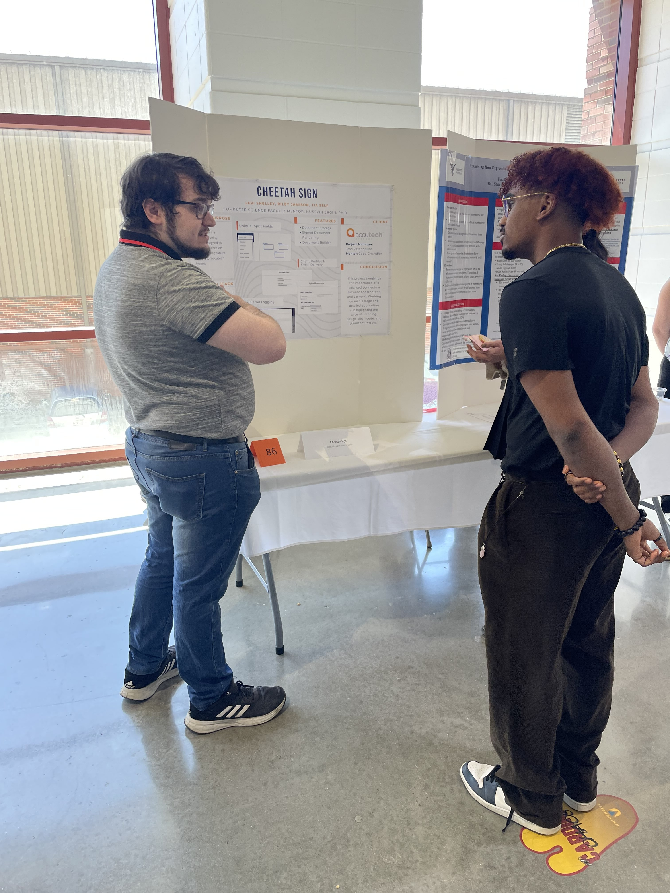

People presented to:

- Leah Strong
- Nini Andis
- Mae Mottern
- Beth
- Joe
- Isaiah King

Leah Strong

Nini Andis & Mae Mottern

Beth

Isaiah King

 
Levi: The student symposium was a very cool experience! I appreciated the chance to interact with other students
about their projects and to see what efforts others have put into their own projects. The symposium has a primary
purpose in helping students learn how to present their findings in the most effective way possible, to both individuals
that are experienced in the field and those who are not. Being able to explain the work that I have done in a group
setting to others will be very important in job settings. Furthermore, it made me think about the project in
interesting ways - what aspects did I not accomplish, how could I have changed the process of development - these aspects
have changed my perception and my workflow in future projects.

Tia: Getting to interact with my classmates during the symposium was a part that stuck with me for the same reasons as Levi.
It was fun to learn more about their projects, what they've learned, and to see how the projects have come together since
last semester when everyone was still trying to figure things out. It also shed light on how those with less or no technical
background understand the project and how we presented the infromation to them based on the questions they asked or parts of
the project they asked for elaboration on. I've had to table at activity fairs before similar to the symposium, but having to
put yourself out there and speak confidently when presenting is something I'm always learning and improving upon.

Riley: I had a lot of fun at the Student Symposium. When you've spent so much time on one project, it becomes very easy to talk about. This helps when some of the people you're presenting to don't come from a technical background. Trying to impress the judges was a challenge, but I think we communicated it well. Getting together with the whole Capstone class was also a lot of fun. It felt nice having this little community that has been doing the same type of project for the past two semesters, and finally come together to celebrate that. Also, the food was very good.
